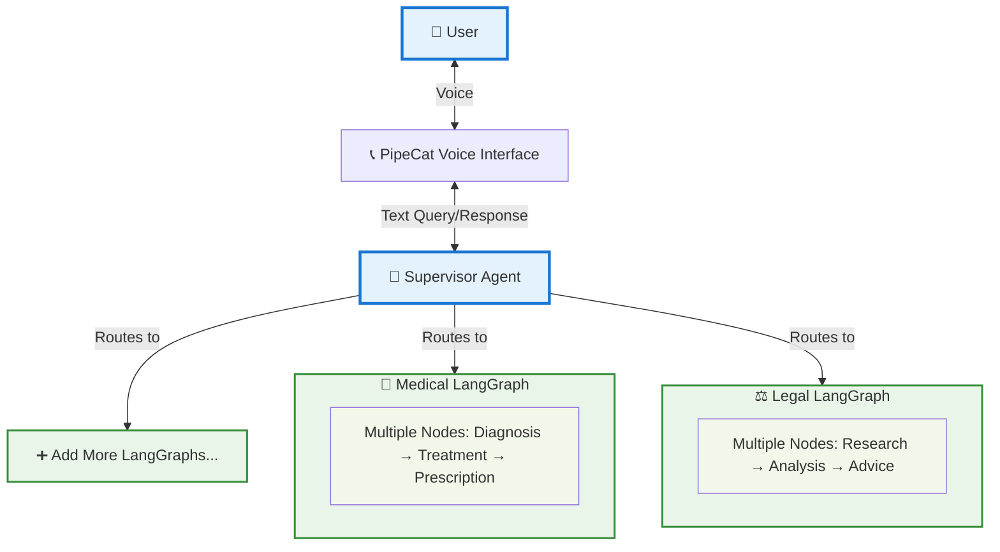

# PipeCat-LangChain Voice AI Agent

A flexible voice AI agent system that seamlessly integrates PipeCat's real-time voice capabilities with LangChain's powerful AI orchestration and LangGraph's multi-agent routing.

## 🏗️ Architecture

This system provides a bridge between PipeCat's voice infrastructure and multiple specialized LangGraph agents through an intelligent supervisor routing system.




### Key Components

- **Voice Interface**: Real-time speech-to-text and text-to-speech using PipeCat
- **Supervisor Agent**: Intelligent routing system that directs queries to appropriate specialized agents
- **Specialized Graphs**: Domain-specific LangGraph agents (e.g., medical assistant)
- **WebRTC Transport**: Low-latency voice communication over web protocols

## 🚀 Features

- Real-time voice conversation with AI agents
- Intelligent query routing based on content analysis
- Specialized domain expertise (medical advice, general assistance)
- Interruptible conversations with natural flow
- WebRTC-based low-latency communication
- Extensible architecture for adding new specialized agents

## 📋 Prerequisites

- Python 3.11 or higher
- [uv](https://github.com/astral-sh/uv) package manager
- OpenAI API key
- Deepgram API key (for speech-to-text)
- Cartesia API key (for text-to-speech)

## 🛠️ Installation

### 1. Install uv (if not already installed)

```bash
# On macOS and Linux
curl -LsSf https://astral.sh/uv/install.sh | sh

# On Windows
powershell -c "irm https://astral.sh/uv/install.ps1 | iex"
```

### 2. Clone the repository

```bash
git clone <your-repo-url>
cd pipecat-langchain-voice-ai
```

### 3. Install dependencies with uv

```bash
# Install all dependencies
uv sync

# Or install in development mode
uv sync --dev
```

### 4. Set up environment variables

Create a `.env` file in the project root:

```env
OPENAI_API_KEY=your_openai_api_key_here
DEEPGRAM_API_KEY=your_deepgram_api_key_here
CARTESIA_API_KEY=your_cartesia_api_key_here
```

## 🎯 Usage

### Running the Voice AI Agent

```bash
# Using uv
uv run python 07b-interruptible-langchain.py

# Or activate the virtual environment and run
uv shell
python 07b-interruptible-langchain.py
```

The application will start a web server (default: `http://localhost:7860`) where you can interact with the voice AI agent through your browser.

### Command Line Options

```bash
python run.py [bot_file] [--host HOST] [--port PORT] [--verbose]
```

- `bot_file`: Path to the bot file (optional, auto-detected)
- `--host`: Host for HTTP server (default: localhost)
- `--port`: Port for HTTP server (default: 7860)
- `--verbose`: Enable verbose logging

## 🔧 Configuration

### Adding New Specialized Agents

1. Create a new LangGraph in `graph.py` or a separate file
2. Update the supervisor routing logic in `supervisor.py`
3. Add the new route condition in the `supervisor_node` function

### Customizing the Medical Agent

Edit the system prompt in `graph.py`:

```python
prompt = ChatPromptTemplate.from_messages([
    ("system", "Your custom medical assistant prompt here"),
    ("human", "{input}")
])
```

### Voice Configuration

Modify voice settings in `07b-interruptible-langchain.py`:

```python
tts = CartesiaTTSService(
    api_key=os.getenv("CARTESIA_API_KEY"),
    voice_id="your_preferred_voice_id",  # Change voice
)
```

## 📁 Project Structure

```
├── supervisor.py              # Main supervisor routing logic
├── graph.py                   # Specialized LangGraph definitions
├── 07b-interruptible-langchain.py  # Main voice AI application
├── run.py                     # Application runner and server setup
├── pyproject.toml            # Project dependencies and metadata
├── .env                      # Environment variables (create this)
└── README.md                 # This file
```

## 🔄 How It Works

1. **Voice Input**: User speaks into the web interface
2. **Speech-to-Text**: Deepgram converts speech to text
3. **Supervisor Routing**: The supervisor agent analyzes the query and routes it to the appropriate specialized agent
4. **Processing**: The selected LangGraph processes the query using OpenAI's GPT model
5. **Response Generation**: The specialized agent generates a contextual response
6. **Text-to-Speech**: Cartesia converts the response to natural speech
7. **Voice Output**: The response is played back to the user

## 🧪 Testing

```bash
# Run with verbose logging for debugging
uv run python 07b-interruptible-langchain.py --verbose

# Test the web interface
# Navigate to http://localhost:7860 in your browser
```

## 🤝 Contributing

1. Fork the repository
2. Create a feature branch (`git checkout -b feature/amazing-feature`)
3. Make your changes
4. Add tests if applicable
5. Commit your changes (`git commit -m 'Add amazing feature'`)
6. Push to the branch (`git push origin feature/amazing-feature`)
7. Open a Pull Request

## 📄 License

This project is licensed under the BSD 2-Clause License - see the LICENSE file for details.

## 🙏 Acknowledgments

- [PipeCat AI](https://github.com/pipecat-ai/pipecat) - Real-time voice AI infrastructure
- [LangChain](https://github.com/langchain-ai/langchain) - AI application framework
- [LangGraph](https://github.com/langchain-ai/langgraph) - Multi-agent orchestration

## 📞 Support

For questions or issues:

1. Check existing [Issues](../../issues)
2. Create a new issue with detailed information
3. Include logs and error messages when reporting bugs

---

**Built with ❤️ using PipeCat, LangChain, and LangGraph**